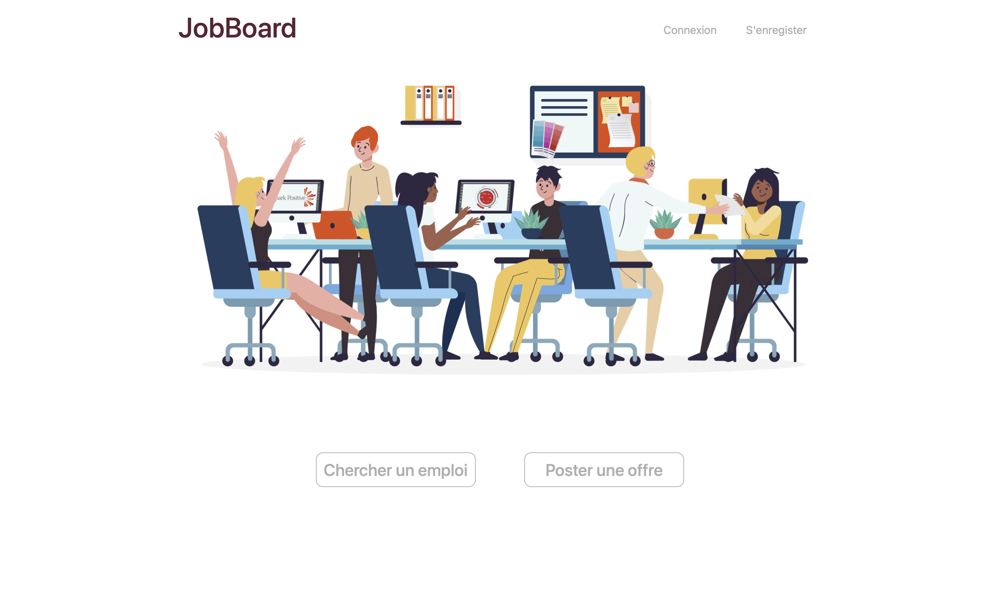
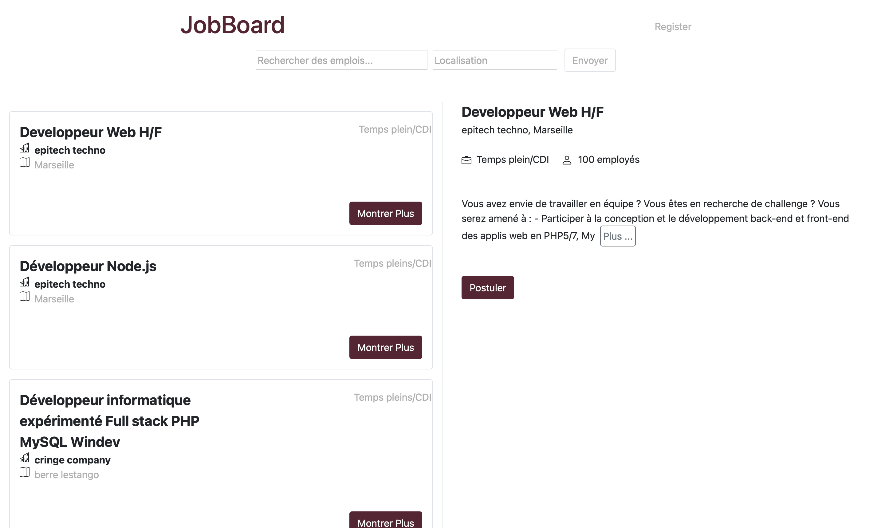
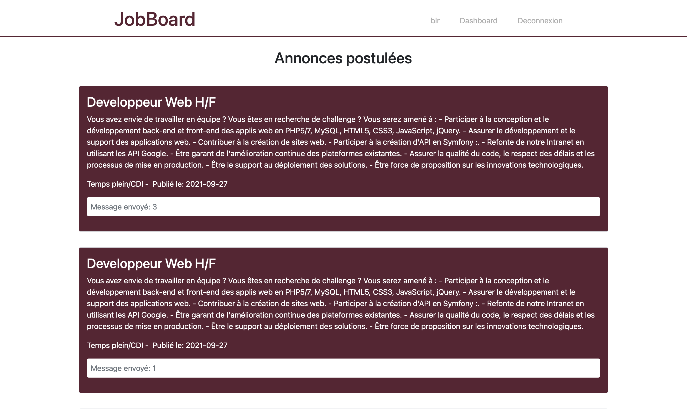
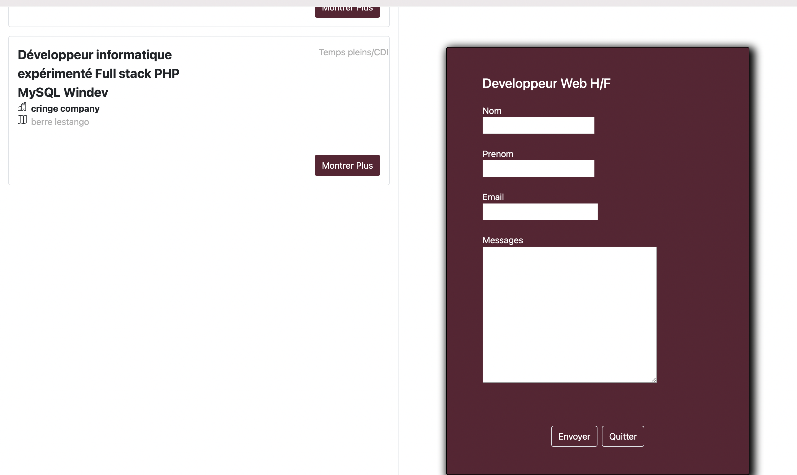
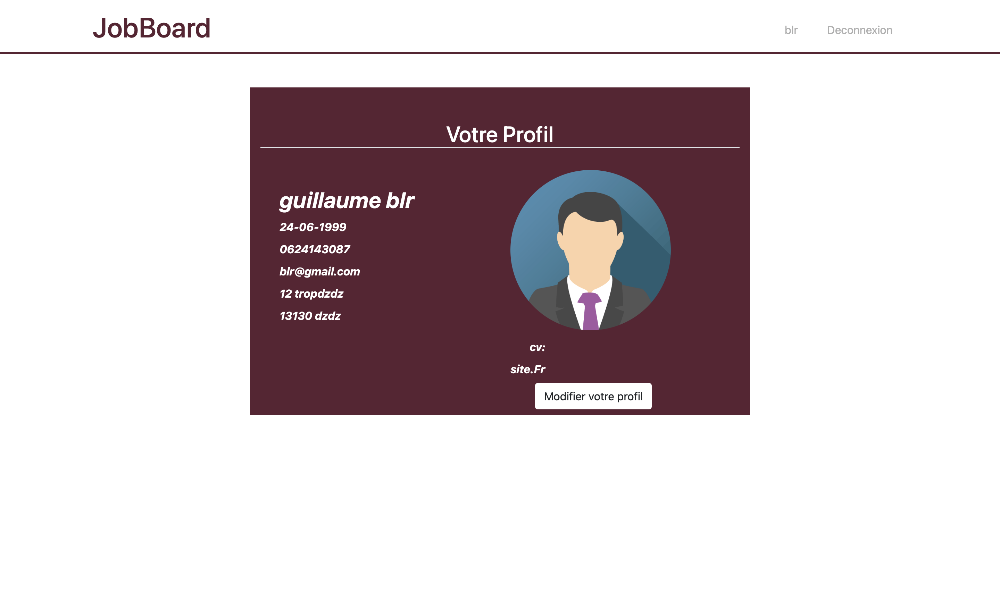
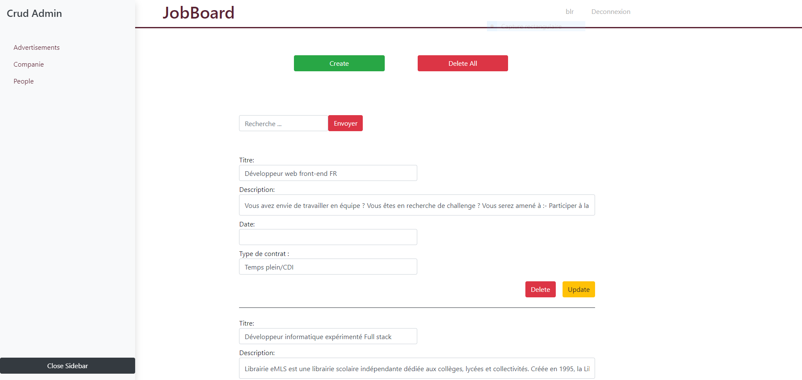

<div id="top"></div>
<!--
*** Thanks for checking out the Best-README-Template. If you have a suggestion
*** that would make this better, please fork the repo and create a pull request
*** or simply open an issue with the tag "enhancement".
*** Don't forget to give the project a star!
*** Thanks again! Now go create something AMAZING! :D
-->


<!-- PROJECT SHIELDS -->
<!--
*** I'm using markdown "reference style" links for readability.
*** Reference links are enclosed in brackets [ ] instead of parentheses ( ).
*** See the bottom of this document for the declaration of the reference variables
*** for contributors-url, forks-url, etc. This is an optional, concise syntax you may use.
*** https://www.markdownguide.org/basic-syntax/#reference-style-links
-->


<!-- PROJECT LOGO -->
<br />
<div align="center">
  <a>
    
  </a>

<h3 align="center">Jobboard</h3>

</div>


<!-- TABLE OF CONTENTS -->
<details>
  <summary>Sommaire</summary>
  <ol>
    <li>
      <a href="#about-the-project">À propos du Projet</a>
    </li>
    <li><a href="#built-with">Fait avec</a></li>
    <li><a href="#prerequisites">Prérequis</a></li>
    <li><a href="#installation">Installation</a></li>
    <li><a href="#usage">Usage</a></li>
    <li><a href="#contact">Contact</a></li>
  </ol>
</details>


<!-- ABOUT THE PROJECT -->
## À propos du Projet



Ce projet visait à réaliser dans un délai de 3 semaines ceci: <br>
• une base de données pour stocker les offres d’emploi,<br>
• une page Web utilisant les technologies Javascript pour afficher un tableau d’annonces d’emploi en ligne ainsi qu’une page d’administration pour l’utilisateur admin,<br>
• un API<br>
• permettre à l’utilisateur de postuler à des emplois<br>
• pour gérer la base de données (uniquement pour l’utilisateur administrateur) - opérations CRUD (création, lecture, mise à jour, suppression)<br>

<p align="right">(<a href="#top">Retour en Haut</a>)</p>


### Fait Avec

* [Nuxt.js](https://nuxtjs.org/)
* [Bootstrap-vue](https://bootstrap-vue.org/)
* [Express.js](https://expressjs.com/)
* [Mysql](https://www.mysql.com/fr/)

<p id="built-with" align="right">(<a href="#top">Retour en Haut</a>)</p>


<!-- GETTING STARTED -->

### Prerequisites


Il vous faudra une plateforme de développement pour mettre en place un serveur web local, comme Wampserver, Xampp etc..
Créer une base de donnée dans phpmyadmin et importer celle du projet Jobboard.sql.

<p id="prerequisites" align="right">(<a href="#top">Retour en Haut</a>)</p>

### Installation

1. Clone le repo
   ```sh
   git clone https://github.com/SamuelCadau/Project-Jobboard.git
   ```
2. Installer les paquets npm dans le dossier `back/` et `jobboard/`
   ```sh
   npm install
   ```
3. Entrer vos infos concernant phpmyadmin et la base de donnée dans `back/lib/db.js`
   ```js
   host: "",
   user: "",
   password: "",
   database: "",
   ```
4. Lancer le site dans le dossier `jobboard/`
   ```sh
   npm run dev
   ```

<p id="installation" align="right">(<a href="#top">Retour en Haut</a>)</p>


<!-- USAGE EXAMPLES -->
## Usage


<br>

<br>

<br>

<br>


<p id="usage" align="right">(<a href="#top">Retour en Haut</a>)</p>


<!-- CONTACT -->
## Contact

Samuel Cadau - [@Om13Samuel](https://twitter.com/Om13Samuel) - samuel.cadau@epitech.eu

Linkedin - [Samuel Cadau](https://www.linkedin.com/in/samuel-cadau-025ba9198/)


<p id="contact" align="right">(<a href="#top">Retour en Haut</a>)</p>

